# PsycheTrajectory

**See the pattern. Hear the person.**

PsycheTrajectory explores how people and psychologists might build shared context about changes between sessions. The repository contains an interactive concept simulator and a separate experimental Python research pipeline for exploring physiological trajectories.

The central design question is not simply whether signals changed, but whether an interpretation fits the person's experience. Try **Signal without meaning** to see a routine shift corrected by context, or **Flat physiology, hard week** to see how passive signals can miss a person's own report.

> **Research prototype:** The simulator uses illustrative scenarios, and the backend's included data is synthetic. Neither is a clinical tool or evidence of clinical validity. Outputs are not diagnoses, and must not guide care.

## Concept video

Watch the short overview: [PsycheTrajectory explained](public/videos/psychetrajectory-explained.mp4).

## Datasets and prototype results

The landing page includes a simple output-metrics panel comparing wearable-only baselines, existing multimodal approaches, and the intended PsycheTrajectory approach. These are **prototype benchmark targets shown in the simulator**, not completed clinical validation results.

### Dataset sources

| Dataset | Access | What it contributes | PsycheTrajectory use |
| --- | --- | --- | --- |
| [CogWear: Can we detect cognitive effort with consumer-grade wearables?](https://physionet.org/content/consumer-grade-wearables/1.0.0/) | Open access | Baseline and Stroop cognitive-load tasks from 24 volunteers across pilot and survey-gamification studies, with Empatica E4, Samsung Galaxy Watch4, and Muse S signals. | Tests whether consumer wearable signals can detect short-term cognitive load and distinguish baseline from demand. |
| [mcPHASES: Physiological, Hormonal, and Self-reported Events and Symptoms for Menstrual Health Tracking with Wearables](https://physionet.org/content/mcphases/1.0.0/) | Restricted PhysioNet access | Longitudinal wearable, hormone, glucose, symptom, sleep, activity, stress, and self-report tables from 42 participants across two 3-month collection periods. | Tests whether longitudinal context and self-report improve interpretation beyond passive physiology alone. |

### Landing-page comparison targets

| Metric shown on landing page | Wearable-only baseline | Existing multimodal | PsycheTrajectory target |
| --- | ---: | ---: | ---: |
| Cognitive-load detection AUC | 64% | 71% | 82% |
| Context-corrected alert precision | 46% | 58% | 76% |
| Meaningful shift recall / session utility | 39% | 53% | 73% |

The intended evaluation is to map CogWear task labels and mcPHASES longitudinal self-report/hormone context into a shared benchmark: passive signals first, then multimodal signals, then PsycheTrajectory-style personal-baseline and human-correction logic.

## Architecture map

```mermaid
flowchart TD
  subgraph group_frontend["Concept app"]
    node_app["Interactive simulator<br/>app/page.tsx"]
    node_app_shell["App shell<br/>app/layout.tsx"]
    node_auth["ChatGPT auth<br/>app/chatgpt-auth.ts"]
    node_db_access["D1 access helper<br/>db/index.ts"]
    node_empty_schema["Empty app schema<br/>db/schema.ts"]
  end

  subgraph group_data["Observation pipeline"]
    node_synthetic["Synthetic signals<br/>synthetic.py"]
    node_io["Observation I/O<br/>io.py"]
    node_schema["Data contracts<br/>schema.py"]
    node_preprocessing["Daily features<br/>preprocessing.py"]
  end

  subgraph group_model["Trajectory modeling"]
    node_encoder["Masked encoder<br/>encoder.py"]
    node_kalman["Trend filter<br/>kalman.py"]
    node_inference["Window inference<br/>inference.py"]
    node_heads["Symptom heads<br/>heads.py"]
    node_api["Inference API<br/>api.py"]
  end

  subgraph group_research["Research workflows"]
    node_backend_cli["Research CLI<br/>cli.py"]
    node_splits["Subject splits<br/>splits.py"]
    node_pipeline["Training and replay<br/>pipeline.py"]
    node_diagnostics["Diagnostics<br/>diagnostics.py"]
  end

  node_person(("Person or clinician"))
  node_d1[("Cloudflare D1")]

  node_person -->|"explores patterns"| node_app
  node_app_shell -.->|"renders"| node_app
  node_backend_cli -->|"generates data"| node_synthetic
  node_backend_cli -->|"reads and writes"| node_io
  node_backend_cli -->|"trains or replays"| node_pipeline
  node_backend_cli -->|"preprocesses"| node_preprocessing
  node_backend_cli -->|"evaluates"| node_diagnostics
  node_backend_cli -->|"trains heads"| node_heads
  node_io -->|"uses types"| node_schema
  node_synthetic -->|"creates observations"| node_schema
  node_preprocessing -->|"uses types"| node_schema
  node_pipeline -->|"aggregates features"| node_preprocessing
  node_pipeline -->|"splits subjects"| node_splits
  node_pipeline -->|"trains and embeds"| node_encoder
  node_pipeline -->|"uses heads"| node_heads
  node_pipeline -->|"filters latents"| node_kalman
  node_heads -->|"uses labels"| node_schema
  node_heads -->|"splits subjects"| node_splits
  node_inference -->|"updates state"| node_kalman
  node_inference -->|"returns result"| node_schema
  node_api -->|"uses filter"| node_kalman
  node_api -->|"uses contracts"| node_schema
  node_db_access -->|"connects to"| node_d1
  node_db_access -->|"configures ORM"| node_empty_schema

  click node_app "https://github.com/raghuram1811/psychetrajectory/blob/main/app/page.tsx"
  click node_app_shell "https://github.com/raghuram1811/psychetrajectory/blob/main/app/layout.tsx"
  click node_auth "https://github.com/raghuram1811/psychetrajectory/blob/main/app/chatgpt-auth.ts"
  click node_backend_cli "https://github.com/raghuram1811/psychetrajectory/blob/main/backend/src/psychetrajectory/cli.py"
  click node_synthetic "https://github.com/raghuram1811/psychetrajectory/blob/main/backend/src/psychetrajectory/synthetic.py"
  click node_io "https://github.com/raghuram1811/psychetrajectory/blob/main/backend/src/psychetrajectory/io.py"
  click node_schema "https://github.com/raghuram1811/psychetrajectory/blob/main/backend/src/psychetrajectory/schema.py"
  click node_preprocessing "https://github.com/raghuram1811/psychetrajectory/blob/main/backend/src/psychetrajectory/preprocessing.py"
  click node_splits "https://github.com/raghuram1811/psychetrajectory/blob/main/backend/src/psychetrajectory/splits.py"
  click node_pipeline "https://github.com/raghuram1811/psychetrajectory/blob/main/backend/src/psychetrajectory/pipeline.py"
  click node_encoder "https://github.com/raghuram1811/psychetrajectory/blob/main/backend/src/psychetrajectory/encoder.py"
  click node_kalman "https://github.com/raghuram1811/psychetrajectory/blob/main/backend/src/psychetrajectory/kalman.py"
  click node_inference "https://github.com/raghuram1811/psychetrajectory/blob/main/backend/src/psychetrajectory/inference.py"
  click node_heads "https://github.com/raghuram1811/psychetrajectory/blob/main/backend/src/psychetrajectory/heads.py"
  click node_diagnostics "https://github.com/raghuram1811/psychetrajectory/blob/main/backend/src/psychetrajectory/diagnostics.py"
  click node_api "https://github.com/raghuram1811/psychetrajectory/blob/main/backend/src/psychetrajectory/api.py"
  click node_db_access "https://github.com/raghuram1811/psychetrajectory/blob/main/db/index.ts"
  click node_empty_schema "https://github.com/raghuram1811/psychetrajectory/blob/main/db/schema.ts"

  classDef toneNeutral fill:#f8fafc,stroke:#334155,stroke-width:1.5px,color:#0f172a
  classDef toneBlue fill:#dbeafe,stroke:#2563eb,stroke-width:1.5px,color:#172554
  classDef toneAmber fill:#fef3c7,stroke:#d97706,stroke-width:1.5px,color:#78350f
  classDef toneMint fill:#dcfce7,stroke:#16a34a,stroke-width:1.5px,color:#14532d
  classDef toneRose fill:#ffe4e6,stroke:#e11d48,stroke-width:1.5px,color:#881337
  classDef toneIndigo fill:#e0e7ff,stroke:#4f46e5,stroke-width:1.5px,color:#312e81
  classDef toneTeal fill:#ccfbf1,stroke:#0f766e,stroke-width:1.5px,color:#134e4a
  class node_app,node_app_shell,node_auth,node_db_access,node_empty_schema toneBlue
  class node_synthetic,node_io,node_schema,node_preprocessing,node_d1 toneAmber
  class node_encoder,node_kalman,node_inference,node_heads,node_api toneMint
  class node_backend_cli,node_splits,node_pipeline,node_diagnostics toneRose
  class node_person toneIndigo
```



## Try the simulator

Requirements: Node.js `>=22.13.0`.

```sh
npm install
npm run dev
```

Then open the local app in the browser and explore the simulator scenarios and narrative walkthrough.

## Backend usage

The backend is intended for generating and testing the research pipeline. The project includes a CLI workflow for synthetic data generation, validation, feature extraction, model training, and evaluation.

See `backend/README.md` for the full setup and command flow. In short, the backend is used to:

- generate synthetic observation data
- validate and normalize it
- preprocess time-series features
- train and evaluate latent-space models
- generate trajectory-style outputs for exploration

A typical workflow looks like this:

```bash
python3.11 -m venv backend/.venv
backend/.venv/bin/python -m pip install -e 'backend[api,parquet,test]'
source backend/.venv/bin/activate
psychetrajectory synthetic --output backend/data/simulated-observations.csv --subjects 8 --days 40 --seed 17
psychetrajectory ingest backend/data/simulated-observations.csv --output backend/data/validated-observations.csv
psychetrajectory preprocess backend/data/validated-observations.csv --output backend/artifacts/daily-features.jsonl
```

## Design principles

PsycheTrajectory is built around a few clear principles:

- personal baseline matters more than population averages
- uncertainty should remain visible
- interpretation should be reviewed by a person and, when relevant, a clinician
- context and disagreement are part of the signal, not noise
- the model should support reflection and treatment conversations, not automate judgment

## License

This project is licensed under the MIT License. See the [LICENSE](LICENSE) file for the full terms.

## Important note

This repository is a prototype and concept demonstrator. It is useful for exploring product concepts, research workflows, and interaction design, but it should not be treated as a production mental-health system or clinical platform.

For implementation details and backend-only documentation, please see:

- `backend/README.md`
- `LOCAL_SETUP.md`
- `MODEL_CARD.md` (when present in the backend research package)
